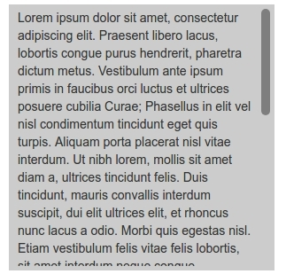

jQuery.scrollBar plugin
======

[](https://falk-m.de)
[](https://github.com/falkmueller/jQuery.scrollBar)
[](LICENSE)
[](https://falk-m.de)

a ligthwight jQuery scrollbar Plugin. Display the scrollbar cross-platform.
[Documentation and Demo](http://code.falk-m.de/scrollBar/).



## Usage

### html Code

```html
 <div class="sb-container">This is a example</div>
```

### Init jQuery.scrollBox

(include scrollBar.css and scrollBar.js in your page before)
```html
 <script>$(".sb-container").scrollBox();</script>
```

When you dynamicly load content call this after them
```html
 <script>$(window).trigger("resize.scrollBox");</script>
```

## Tested

- Chrome (Pc, Android Tablet)
- Firefox (Pc, Android Tablet)
- Internet Explorer 11 (Pc)
- Safari (Mac Book, iPad)